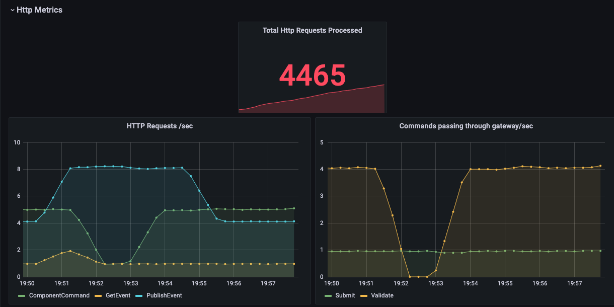
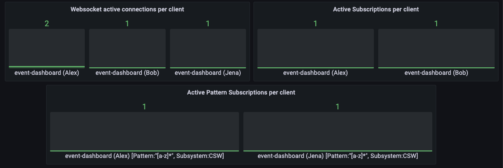

# Gateway Technical Documentation

Gateway gives access to all CSW and ESW services (available to user) and components from browser-based user interfaces.
Gateway also enforces auth on command and sequencer APIs to protect from unauthorised access.

## Implementation

Gateway service is an HTTP service which relies on `msocket` framework. Internally it delegates to the various
services(of both ESW or CSW) needed as per the request.

It provides access to following:

* Command Service APIs (CSW)
* Alarm APIs (CSW)
* Event APIs (CSW)
* Sequencer Service APIs (ESW)
* Admin APIs (ESW)
* Logging APIS (ESW)

Some services are not part of the gateway. This is mainly because of 2 reasons:

1. The services can be accessed via its own HTTP interface. Example, Config Service.
1. The services are not user facing. Example, Sequence Manager Service.

The security directives created in the app for command and sequencer services are passed on to the routes in order to
enable auth for command and sequencer services.

## API call flow

Let's take an example of `AbortSequence` command coming from browser to sequencer service via a gateway:

1. Since sequencer APIs are protected using auth, the UI app gets a valid token from `AAS` that will enable access to
sequencer API in gateway.
1. The UI app will create a `abortSequence` request using the auth token and send it to gateway.
1. Gateway validates the request auth token and the role of UI app against the `command role config`.
1. If the validation is successful, gateway delegates the request to sequencer service.
1. Sequencer service executes the request and return the stepList as response.
1. This response is given back to the UI app that made the request.

Below diagram depicts the flow mapped by above points:

## Modules

### esw-gateway-api

All the request models, clients, and APIs exposed in gateway service resides within this module.
This also contains the codecs for the models.

It is a cross-compiled project which has following parts:

* js - code used by scala-js.
* jvm - code used by jvm
* shared - code which can be used by both scala-js and jvm

### esw-gateway-impl

This module depends on `esw-gateway-api` and contains implementation for all the apis declared in `esw-gateway-api`.
In case of CSW services(ex, Event Service, Alarm Service), the implementation delegates the call to respective CSW service.

### esw-gateway-server

This module contains the main application which when run starts the gateway server. This includes server wiring,
post and websocket handlers and cli app.

This module depends on `esw-http-core` for starting up an HTTP service.

## Running Gateway Server

For running Gateway server, please refer @ref:[this](../uisupport/gateway-app.md).

## Metrics

Gateway has support for capturing metrics. The metrics can be enabled by providing `--metrics` or `-m` flag
while starting gateway-server application.

Gateway metrics are powered by [prometheus](https://prometheus.io/). We use prometheus java [client](https://github.com/prometheus/client_java) to capture http and websocket based metrics.
Gateway exposes `/metrics` endpoint where snapshot of metrics can be fetched. Prometheus server then polls the metrics endpoint and stores the metrics in a time series database which then can be used for visualization using tools like grafana.

Gateway metrics are categorized into two major sections that are **HTTP Metrics** and **Websocket Metrics**.

### HTTP Metrics

HTTP metrics section includes following different types of metrics:

1. Total HTTP requests processed by gateway. This includes all the commands, events, log etc. messages processed by gateway since the beginning.
1. HTTP requests flowing via gateway per second. These are categorized by command type, for example, `ComponentCommand`, `SequencerCommand`, `GetEvent`, `PublishEvent` etc. This metric help us to understand trend of requests processed per second.
1. Commands passing through gateway per second. These commands can be `Submit`, `Validate`, `Oneway` etc.

### Websocket Metrics

Websocket metrics section includes following different types of metrics:

1. Active Websocket connections. This number indicates all the currently connected websocket clients to gateway.
As soon as websocket connection gets disconnected, this number decreases.
1. Active event service pattern subscribers. (CommandType = `SubscribeWithPattern`)
1. Active event service subscribers. (CommandType = `SubscribeEvent`)
1. Active websocket request per second. This indicates trend of websocket connections over period of time.
1. Events rate per client/sec. This indicates rate at which events are flowing via websocket connection. Here client indicates unique application name and hostname combination, for example, `{app_name: eng-ui, hostname: 192.168.1.3}`
1. Active websocket connections per client. This indicates number of active websocket connections per unique application name and hostname combination.
1. Active event subscriptions per client. This indicates number of active event subscribers per unique application name and hostname combination.
1. Active event pattern subscriptions per client. This indicates number of active event subscribers per unique application name and hostname combination.

See the screenshots below from the integration of gateway metrics with Prometheus/Grafana.

@@@ note

Above screenshots are taken by following instruction provided [here]($github.base_url$/scripts/metrics/README.md).

@@@
