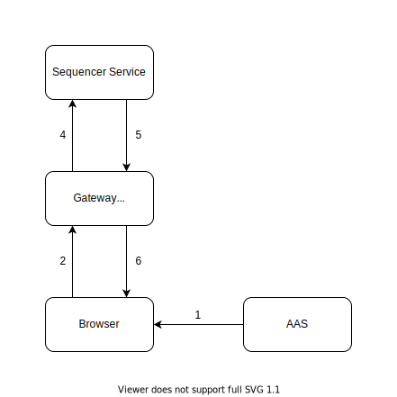

# Gateway Technical Documentation

The User Interface Gateway gives access to all CSW and ESW services (available to user) and components from browser-based user interfaces.
The Gateway also enforces authorization on Command Service APIs to components and Sequencer APIs to protect from unauthorized access.

## Implementation

The Gateway is an HTTP service which relies on `msocket` framework. Internally it delegates to the various
services(of both ESW or CSW) needed as per the request.

It provides access to following:

* Command Service APIs (CSW)
* Alarm APIs (CSW)
* Event APIs (CSW)
* Sequencer APIs (ESW)
* Admin APIs (ESW)
* Logging APIS (ESW)

Some services are not part of the Gateway. This is mainly because of 2 reasons:

1. The service can be accessed via its own HTTP interface. Example, Config Service.
1. The service is not user facing. Example, the Sequence Manager Service.

The Command and Sequencer Command Services provide configurable protection to restrict certain commands to certain users.
This is done by applying security directives on the Command Service routes that check for proper authorization.

## API call flow

Let's take an example of `AbortSequence` command coming from a browser to a Sequencer via the Gateway:

1. Since Sequencer APIs are protected using authorization, the UI app gets a valid token from `AAS` that will enable access to
Sequencer API in the Gateway.
1. The UI app will create an `abortSequence` request using the authorization token and send it to the Gateway.
1. The Gateway validates the request authorization token and the role of UI app against the `command role config`.
1. If the validation is successful, the Gateway delegates the request to the Sequencer Command Service.
1. The Sequencer executes the request and returns the `stepList` as a response.
1. This response is given back to the UI app that made the request.

Below diagram depicts the flow mapped by above points:

## Modules

### esw-gateway-api

All the request models, clients, and APIs exposed in gateway service resides within this module.
This also contains the codecs for the models.

It is a cross-compiled project which has following parts:

* js - code used by scala-js.
* jvm - code used by jvm
* shared - code which can be used by both scala-js and jvm

### esw-gateway-impl

This module depends on `esw-gateway-api` and contains implementation for all the apis declared in `esw-gateway-api`.
In case of CSW services(ex, Event Service, Alarm Service), the implementation delegates the call to respective CSW service.

### esw-gateway-server

This module contains the main application which when run starts the gateway server. This includes server wiring,
post and websocket handlers and cli app.

This module depends on `esw-http-core` for starting up an HTTP service.

## Running Gateway Server

For running Gateway server, please refer @ref:[this](../uisupport/gateway-app.md).

## Metrics

The Gateway has support for capturing metrics. The metrics can be enabled by providing `--metrics` or `-m` flag
while starting the `gateway-server` application.

Gateway metrics are powered by [Prometheus](https://prometheus.io/). We use a Prometheus Java [client](https://github.com/prometheus/client_java) to capture HTTP and websocket-based metrics.
The Gateway exposes a `/metrics` endpoint where a snapshot of metrics can be fetched. The Prometheus server then polls the metrics endpoint and stores the metrics in a time series database which then can be used for visualization using tools like [Grafana](https://grafana.com/).

Gateway metrics are categorized into two major sections: **HTTP Metrics** and **Websocket Metrics**.

### HTTP Metrics

The HTTP metrics section includes following different types of metrics:

1. Total HTTP requests processed by the Gateway. This includes all the commands, events, log etc. messages processed by the Gateway since it was started.
1. HTTP requests flowing via the Gateway per second. These are categorized by command type, for example, `ComponentCommand`, `SequencerCommand`, `GetEvent`, `PublishEvent` etc. This metric helps us to understand the trend of requests processed per second.
1. Commands passing through the Gateway per second. These commands can be `Submit`, `Validate`, `Oneway` etc.

### Websocket Metrics

The Websocket metrics section includes the following different types of metrics:

1. Active WebSocket connections. This number indicates all the currently connected websocket clients to the Gateway.
As soon as a WebSocket connection gets disconnected, this number decreases.
1. Active Event Service pattern subscribers. (CommandType = `SubscribeWithPattern`)
1. Active Event Service subscribers. (CommandType = `SubscribeEvent`)
1. Active WebSocket requests per second. This indicates the trend of WebSocket connections over a period of time.
1. Event rate per client per second. This indicates the rate at which events are flowing via a WebSocket connection. Here, a client indicates a unique application name and username combination, for example, `{app_name: eng-ui, username: Jena}`
1. Active WebSocket connections per client. This indicates the number of active WebSocket connections per unique application name and username combination.
1. Active event subscriptions per client. This indicates the number of active event subscribers per unique application name and username combination.
1. Active event pattern subscriptions per client. This indicates the number of active event subscribers per unique application name and username combination.

The following screenshots show some example Gateway metrics using Grafana.

@@@ note

The screenshots above were taken by following the instructions provided [here]($github.base_url$/scripts/metrics/README.md).

@@@
