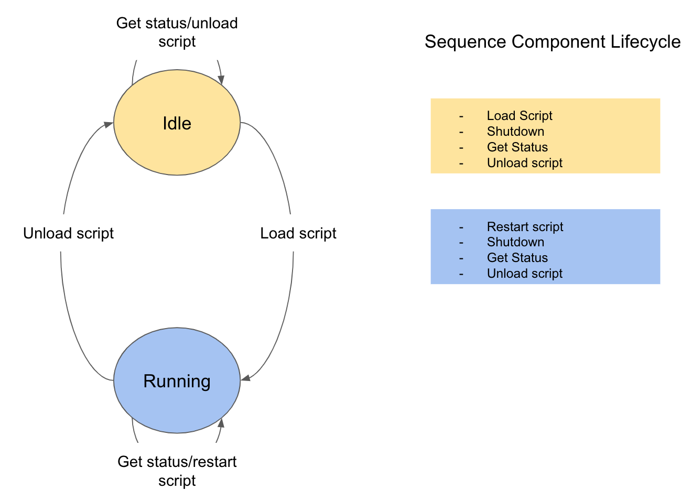

# Sequence Component Technical Documentation

## Introduction
The Sequence Component is a standalone application that can load scripts and in doing so, become a Sequencer. In the OCS
*scripting* approach, the Sequence Component is the reusable environment that supports the execution of different scripts.
Use of the Sequence Component also reduces the time to load a Sequencer Script--similar to a scripting language shell.

Sequence Component will be a continuously running JVM process which will load and unload different script. 
When loading a script, the Sequencer will be started as a part of existing Sequence Component process.
This step minimizes the start-up time for Sequencer to a fraction of a second. 

The Sequence Component application and its arguments are described @ref[here](../sequencersandscripts/sequencer-app.md).

## Modules

* esw-ocs-api -
This module contains the API for Sequence Component. This is cross-compiled module, which is compiled into JVM as well as JS code. 
This module includes `SequenceComponentApi`, which defines the interface for Sequence Component. This module also 
consists of core models, actor client, JVM and JS client for Sequence Component.

* esw-ocs-impl -
This module consists of core implementation of Sequence Component which is `SequenceComponentActor`.

* esw-ocs-app -
This module consists of wiring as well as cli application to start Sequence Component. The wiring is the code that
integrates Sequence Component to the ESW/CSW environment.

## Implementation Details

The Sequence Component is written in Scala to provide integration with the CSW Component Framework and Services. Since component
developers do not need to modify Sequence Component code, there is no Java version.

The Sequence Component registers itself with the Location Service when started. This allows the Sequence Manager to
find the Sequence Component and send it commands. Sequence Component is started with a Subsystem and an optional name.
While the Subsystem for a Sequence Component identifies to which subsystem the Sequence Component belongs, a Sequence
Component can load Scripts for any subsystem, and therefore become a Sequencer for any subsystem.  For example, if for
some reason the IRIS Sequence Component is not reachable, an IRIS Script can be loaded into an ESW Sequence Component
and it can then be used as the IRIS Instrument Sequencer.

Sequence Component will be registered as Akka Connection in Location Service.
The following table describes the registration of a Sequence Component in the Location Service:

| Subsystem | Name | Registered Location |
|:---------:|:----:|:-------------------:|
| ESW | (none) | ESW.ESW_77 |
| ESW | primary |  ESW.primary |

Note that CSW always capitalizes a subsystem when it is displayed. Arguments can be entered as lowercase.

@@@warning
In all cases, the subsystem must be the acronyms defined by Systems Engineering and as defined in CSW. If the
subsystem is not a valid TMT subsystem, an error will occur.
@@@

@@@note
If `Name` is not provided while starting Sequence Component, it will be uniquely generated using pattern -`Subsystem`.`Subsystem`_`<Random number 1 to 100>`.
There exists possibility that, this generated name is already taken by another Sequence Component. To solve this scenario, Sequence
Component registration involves retry mechanism which then generates another name and starts Sequence Component.
@@@

The Sequence Component provides framework code to support the loading and unloading of Scripts and a few other
useful capabilities.

| Message | Description |
|:-------:|:----------|
| LoadScript| Load a script in the Sequence Component to create a Sequencer. Takes a subsystem and observing mode as arguments. |
| UnloadScript|Unloads a loaded script returning a Sequence Component. |
| RestartScript | Unloads and reloads a script causing initialization of state. |
| GetStatus | Returns the Location of the Sequence Component's loaded Sequencer |
| Shutdown | Shutdown sequence component and sequencer loaded(if any) |

For more details on the messages handled by the Sequence Component see [here]($github.base_url$/esw-ocs/esw-ocs-api/jvm/src/main/scala/esw/ocs/api/actor/messages/SequenceComponentMsg.scala)

## Sequence Component Lifecycle

Sequence Component is implemented as Finite State Machine using Akka Actor as core.
The Sequence Component also has a lifecycle, but it is simpler than the Sequencer lifecycle. The following
figure shows the Sequence Component has two states: `Idle` and `Running`.

* **Idle:** This is the default state of a Sequence Component when it is started. It is ready for the loading
of a Script that will create a Sequencer, which occurs on a `LoadScript` command. If successful, the Sequence
Component transitions to the `Running` state. While in the `Idle` state, the Sequence Component responds to the `GetStatus` message
and ignores the `UnloadScript` message without error. For `RestartScript` message, sequence component responds with error
saying `RestartScript` in unhandled in `idle` state.

* **Running:** Once a Sequence Component has successfully loaded a Script, it is in the `Running` state. The new
Sequencer will be available to process Sequences until it receives an `UnloadScript` message and transitions back
to the `Idle` state. While in the `Running` state, the Sequence Component can also receive a `RestartScript` message,
which restarts a Sequencer by unloading the Script and shutting down the Sequencer, immediately followed by the
loading of the Script again. This has the effect of initializing the script. For `LoadScript` message, sequence component
responds with error saying that `LoadScript` is unhandled in `Running` state.
The Sequence Component responds successfully to the `GetStatus` message.

@@@note
`Shutdown` sequence component message is handled in both `Idle` and `Running` state. In `Idle` state, it un-registers sequence component
in location service, terminates actor system and gracefully shutdown sequence component. In `Running` state, shutdown consist of additional step
apart from `Idle` state shutdown, which is shutting down sequencer loaded on the sequence component.
@@@

## Running Sequence Component

For running Sequence Component Stand-alone or with Sequencer Script, please refer @ref:[this](../sequencersandscripts/sequencer-app.md).
