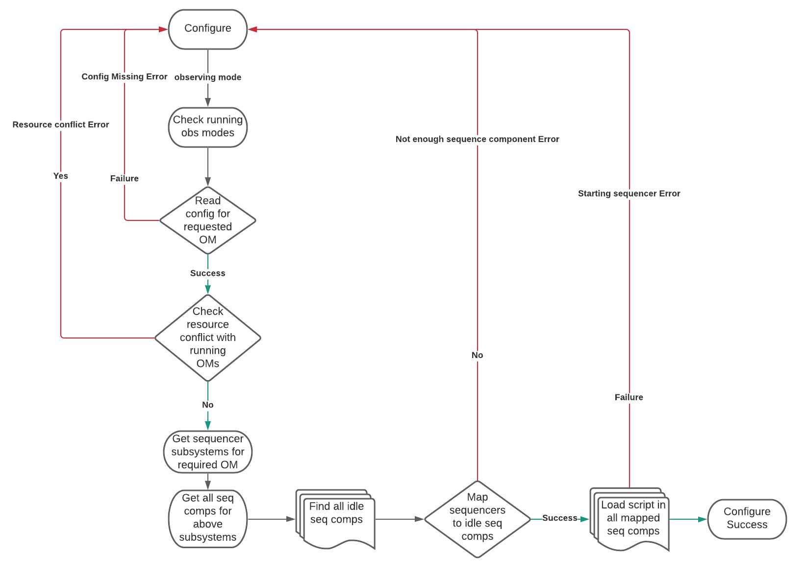

# Sequence Manager
## Introduction

Sequence Manager is ESW component which takes care of provisioning sequence components needed for observation, configuration of
sequencer scripts as per observing mode. It has capabilities to start, re-start, shutdown sequencer/s, shutdown sequence components
as well as to know status of TMT components like which sequencer script is loaded on which sequence component, which sequence component/s
are running on which agent. Sequence Manager is implemented using Akka actor. Sequence Manager provides two interfaces.

1. Akka interface
2. HTTP interface

Akka interface will be used by JVM applications to interact with Sequence Manager. HTTP interface is provided so UI applications
can be built which will interact Sequence Manager.

## Modules

Sequence Manager implementation is distributed into following sub modules:

### esw-sm-api
This sequence manager API module is responsible for providing:

1. shared - API which is cross compiled to JVM as well JS
2. shared - HTTP client which can be used by JVM as well as scala-js applications
3. jvm - Akka client for JVM applications, Akka actor messages, akka serializer

### esw-sm-handler
This sequence manager handler module is responsible for providing HTTP routes for sequence manager HTTP server.

### esw-sm-impl
This module contains core logic for Sequence Manager Actor.

### esw-sm-app
This module contains cli which starts sequence manager component as well as HTTP server of Sequence Manager

## Implementation Details

Boot-up time for TMT ecosystem is expected to start agent on every machine, sequence manager on ESW machine and HCD/Assembly components on
respective subsystem machines.

Sequence Manager support multiple APIs which allows to configure for an observing mode, cleanup after observation is done etc.

Flow for configuration of observing mode is described below:

### GetAgentStatus
This API allows to show status of TMT ecosystem components (agents, sequence components and sequencers).
It shows which all agents are up and running, sequence components running on those agents and sequencer script loaded on sequence component

@@@note
At this point of time no sequence components or sequencers are present in system as provisioning is not done.
@@@

### Provision
This API allows to provision sequence components per agent. This API requires configuartion which specifies no of sequence components needed to be
spawned on particular agent.

Following diagram depicts status of TMT ecosystem after provisioing as per config

@@@note
Provision API shutdown all running sequence components if any. After shutting down already running sequence components, it spawns new sequence
components on agents as per configuration provided at the time of provision.
@@@

Following flow chart shows algorithm for provision flow

### Configure
Configure is responsible for starting sequencers needed for an observing mode. It also checks for any resource conflicts with ongoing observations.
Configure API, checks for required sequencers and resources in obsModeConfig file provided at boot up time sequence manager. This config file contains mapping of observing mode
to required sequencers and resources. When configure for particular observing mode command is received by Sequence Manager, it checks following:

* Mapping for required observing mode exists in configuration file
* availability of adequate sequence components for starting sequencers
* no resource conflict should occur with ongoing observations

@@@note
Once Sequence Manager configures for an observing mode, sequence can be sent to top level sequencer (ESW sequencer for that observing mode) by SOSS
@@@

Following flow chart shows algorithm for configure flow

### Shutdown Sequencers
Once observation is complete, cleanup for that observation involves shutting down all sequencers of that observing mode.
Sequence Manager provides shutdown sequencers API variations which allow to shutdown all sequencers of an observing mode, shutdown all sequencer belonging to specific
subsystem, shutdown a particular sequencer and shutdown all running sequencers.

### Other APIs
Apart from APIs explained above, sequence manager also provides following APIs:

* getRunningObsModes - gives information about all running observing modes
* startSequencer - start sequencer for provided subsystem and observing mode
* restartSequencer - re-start sequencer for provided subsystem and observing mode
* shutdownSequenceComponent - shutdown a sequence component with provided prefix
* shutdownAllSequenceComponents - shutdown all running sequence components

## State Transition

Sequence Manager Actor is implemented as state machine. It has two states: Idle and Processing. At any point of time,
sequence manager can be in exactly one of these states.

Following digram depicts state transition for sequence manager:

Implementation of these msgs is asynchronous in nature. So handling any other msgs while previous msg processing is incomplete can
result in inconsistent system. For example,
configure Observing_Mode_1 msg is received by Sequence Manager Actor. Let's assume that this requires to start ESW, IRIS and TCS sequencers.
Configure flow has checked for resource conflict. No conflict is there so configure goes ahead with processing. During this processing,
if any other msg like startSequencer for IRIS subsystem and Observing_Mode_2 is recieved then this will result in inconsistent behaviour.
To avoid these cases, certain msgs are accepted only when sequence manager is idle. When any one of idle state msg is received, sequence manager
goes into processing state where it accepts only common msgs (read state msgs which will not cause any inconsistency). In processing state, actor waits
for processing complete msg. Once processing complete msg is recieved, actor goes back to idle state and ready to process any of idle state msg. Both idle
and processing state can handle commom msgs without any state change.

