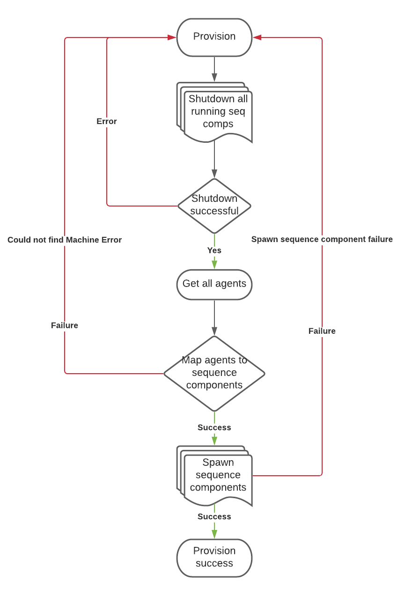
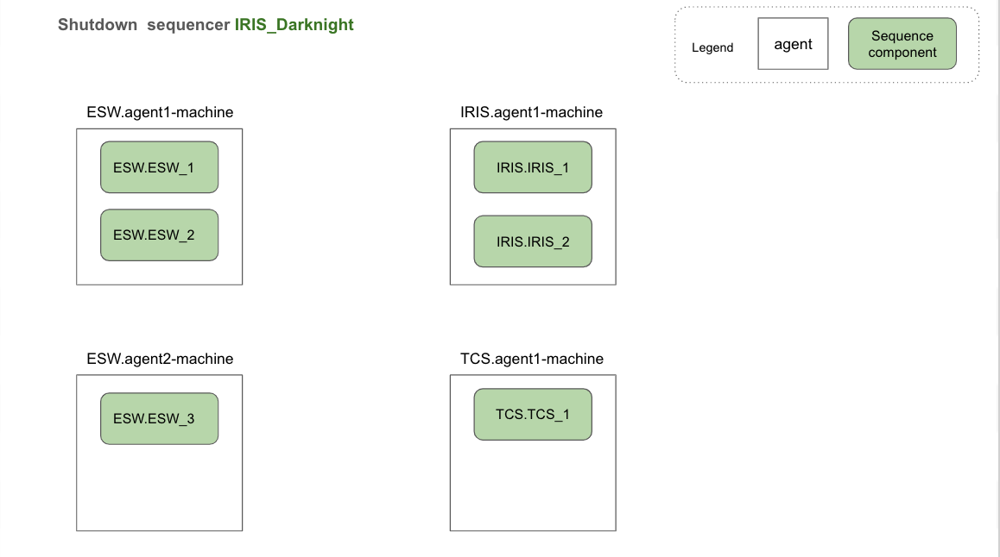

# Sequence Manager Implementation Details

Boot-up time for TMT ecosystem is expected to start agent on every machine, sequence manager on ESW machine and HCD/Assembly components on
respective subsystem machines.

Sequence Manager support multiple APIs which allows to configure for an observing mode, cleanup after observation is done etc.

Flow for configuration of observing mode is descriobed below:

## GetAgentStatus
This API allows to show status of TMT ecosystem components (agents, sequence components and sequencers).
It shows which all agents are up and running, sequence components running on those agents and sequencer script loaded on sequence component

@@@note
At this point of time no sequence components or sequencers are present in system as provisioning is not done.
@@@

## Provision
This API allows to provision sequence components per agent. This API requires configuartion which specifies no of sequence components needed to be
spawned on particular agent.

Following diagram depicts status of TMT ecosystem after provisioing as per config

@@@note
Provision API shutdown all running sequence components if any. After shutting down already running sequence components, it spawns new sequence
components on agents as per configuration provided at the time of provision.
@@@

Following flow chart shows algorithm for provision flow

## Configure
Configure is responsible for starting sequencers needed for an observing mode. It also checks for any resource conflicts with ongoing observations.
Configure API, checks for required sequencers and resources in obsModeConfig file provided at boot up time sequence manager. This config file contains mapping of observing mode
to required sequencers and resources. When configure for particular observing mode command is received by Sequence Manager, it checks following:

* Mapping for required observing mode exists in configuration file
* availability of adequate sequence components for starting sequencers
* no resource conflict should occur with ongoing observations

@@@note
Once Sequence Manager configures for an observing mode, sequence can be sent to top level sequencer (ESW sequencer for that observing mode) by SOSS
@@@

Following flow chart shows algorithm for configure flow

## Shutdown Sequencers
Once observation is complete, cleanup for that observation involves shutting down all sequencers of that observing mode.
Sequence Manager provides shutdown sequencers API variations which allow to shutdown all sequencers of an observing mode, shutdown all sequencer beloging to specific
subsystem, shutdown a particular sequencer and shutdown all running sequencers.

## Other APIs
Apart from APIs explained above, sequence manager also provides following APIs:

* getRunningObsModes - gives information about all running observing modes
* startSequencer - start sequencer for provided subsystem and observing mode
* restartSequencer - re-start sequencer for provided subsystem and observing mode
* shutdownSequenceComponent - shutdown a sequence component with provided prefix
* shutdownAllSequenceComponents - shutdown all running sequence components
