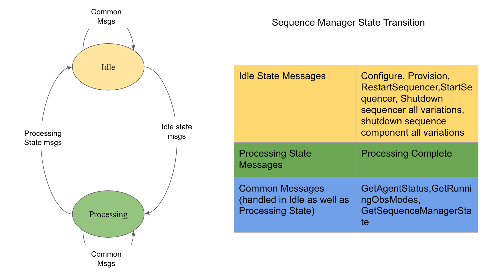

# Sequence Manager State Transition

Sequence Manager Actor is implemented as state machine. It has two states: Idle and Processing. At any point of time,
sequence manager can be in exactly one of these states.

Following digram depicts state transition for sequence manager:

Implementation of these msgs is asynchronous in nature. So handling any other msgs while previous msg processing is incomplete can
result in inconsistent system. For example,
configure Observing_Mode_1 msg is received by Sequence Manager Actor. Let's assume that this reuires to start ESW, IRIS and TCS sequencers.
Congigure flow has checked for resource conflict. No conflict is there so configure goes ahead with processing. During this processing,
if any other msg like startSequencer for IRIS subsystem and Observing_Mode_2 is recieved then this will result in inconsistent behaviour.
To avoid these cases, certain msgs are accepted only when sequence manager is idle. When any one of idle state msg is received, sequence manager
goes into processing state where it accepts only common msgs (read state msgs which will not cause any inconsistency). In processing state, actor waits
for processing complete msg. Once processing complete msg is recieved, actor goes back to idle state and ready to process any of idle state msg. Both idle
and processing state can handle commom msgs without any state change.
