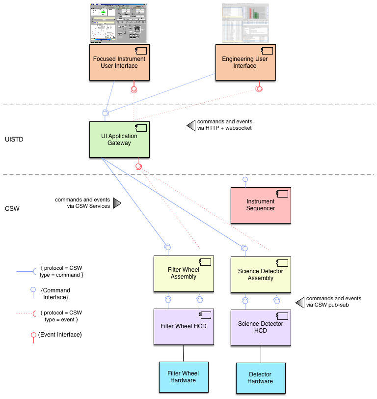
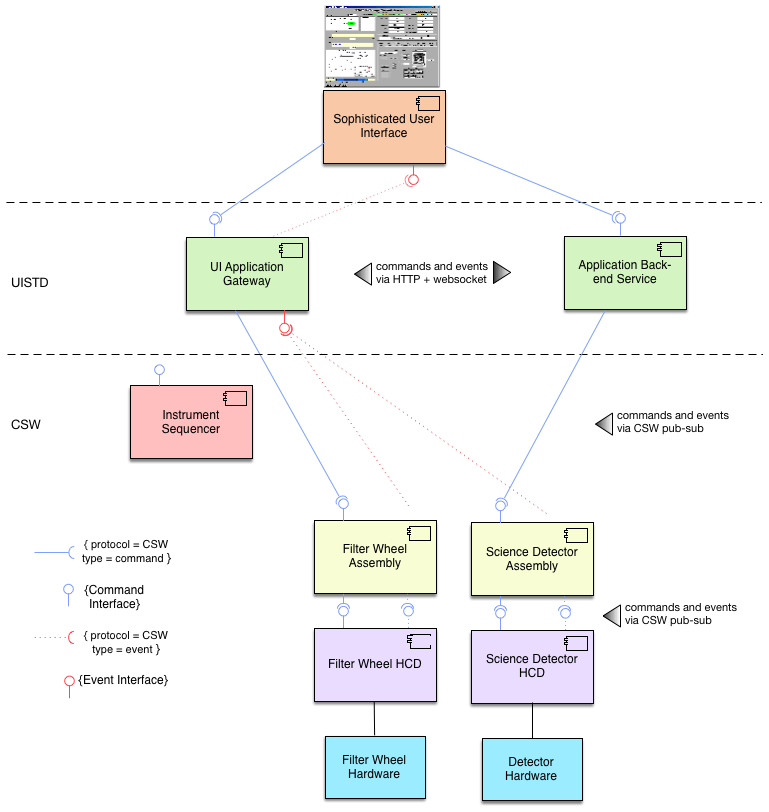

# User Interfaces in ESW and TMT

This section is an overview of the user interface approach for TMT.
TMT has an OAD requirement for graphical user interfaces or GUIs as the standard style for user interfaces. The CSW technical choice for 
graphical user interfaces is the web platform consisting of the web browser as the host for the user interface and web 
technologies based on JavaScript along with HTTP, and CSS, etc. Most UI innovation and development at this time is 
based on these technologies and there is no apparent change in sight, so this decision continues to make sense.
One other big advantage of the browser-based UI is that it can provide an easier solution for remote access in many situations. 
After all, the entire reason for web technologies is to provide remote access to systems and services.

## ESW.UISTD and ESW.HCMS

TMT user interfaces can be grouped into two categories: observing user interfaces and engineering user interfaces.
High-level Control and Monitoring (HCMS) is the ESW subsystem that provides the observing user interfaces 
to be used by staff and visitors to control the telescope and other systems, monitor their
status and behavior, and to perform observations that generate science data. Engineering user interfaces are 
the responsibility of the subsystem teams, but these user interfaces also use the technology choices and support provided
by ESW. The HCMS user interfaces are focused on the information needed for observing; engineering user interfaces often provide
access to low-level diagnostic and engineering functions.

ESW’s User Interface Standards (UISTD) subsystem provides the architectural solution for this technical problem.
UISTD also provides glue code for the JavaScript-based environment that is used by UI builders to access CSW services 
along with examples. UISTD provides style and layout guidelines and standards (look-and-feel) with examples that demonstrate 
the guidelines. UISTD also provides UI components that demonstrate common usage of CSW glue code (TBD as needed). 
This document describes the UI architecture.

## User Interface Support in ESW Phase 1

The development of ESW was split into two phases called Phase 1 and Phase 2. Phase 1 completed development in late 2021. It
delivers products and features that other subsystems need from ESW for their development or testing. ESW Phase 2 will execute in the future and will cover the 
remaining parts of ESW.

### User Interface Responsibilities of ESW
The following bullet items summarize the responsibilities of UISTD and HCMS and whether they are part of Phase 1 or Phase 2.

* Provide JavaScript-based glue code running in the browser providing access to CSW services needed by user interfaces (UISTD) (Phase 1).
* Provide a gateway/bridge infrastructure that connects the browser-based user interfaces to the JVM-based services and components (UISTD) (Phase 1).
* Provide examples of glue code usage and user interface standards (UISTD) (Phase 2, some Phase 1).
* Provide style and layout guidelines for standardized user interface look and feel (UISTD) (Phase 2)
* Provide browser-based user interfaces required by support staff for control and monitoring of the telescope and instrument systems (HCMS) (Phase 2).

## ESW Phase 1 Overview

The primary technical problem the UI architecture must solve is that a browser-based user interface executes in a different 
software environment from JVM-based CSW/ESW using a different language and technology; therefore, it is necessary to bridge the 
two environments. This is true of any control system technology that isn’t written in JavaScript and is not unique to 
the CSW JVM choice.

The ESW design for user interfaces identifies two approaches for user interfaces that we have named: **Gateway-only UI** and **Web Applicstion UI**. The
difference between the two is based on the sophistication and requirements of the user interface.

## Gateway-only UI Applications

A Gateway-only UI is a user interface only uses the CSW services including: Command Service, Event Service, Logging, 
Configuration Service, Location Service, Time Service, and Authentication and Authorization Service. It is expected that 
many or most observing user interfaces fall into this category. A UI that needs Database Service must create a Web Application UI, which is covered below.  

The following figure shows an example instance of the 
ESW architecture for a simplified instrument and its user interface (or Engineering UI) that is a Gateway-only UI application.
The figure shows an example user interface executing in the browser called “Focused Instrument User Interface” that must 
send commands to and receive events from individual Assemblies in the CSW-based instrument control system in the 
lower part of the figure represented by a Sequencer and two Assemblies/HCDs.

Commands are issued when the user pushes a button on the UI to move the filter wheel (or other device). Events are 
subscribed to and received by the UI that contain the current positions of the filter wheel and grating. 
The event contents are used to update information on the UI to keep the user up to date on the state of the instrument.

The UI Application Gateway is JVM-based server that provides an HTTP-based interface with routes for CSW services including 
sending commands and subscribing to events. Command completion information and events are returned to the 
UI through Websockets. Commands, responses, and events are serialized as JSON, which is already supported in CSW and is
easily handled in web technologies.

@@@note
The term *frontend* is often used in user interface documentation to encapsulate the technologies and code of a browser-based user interface project.

The term *backend* is used to describe the technologies and code that make up the part of the system the browser-based user interface communicates
with.  Backend is also sometimes called *server-side*.

For a Gateway-only UI, the UI part of a project is the _frontend_, and the UI Application Gateway is the _backend_.
@@@

There is a template project that can be used to create a Gateway-only user interface as well as a tutorial.
See the dedicated documentation section @ref:[here](gatewayUI-template.md) for more information.

###User Interface Application Gateway

The key is the UI Application Gateway (UIAG) provided as part of UISTD/ESW Phase 1 shown in green in the figure. 
The UIAG is a JVM-based application that acts as an authenticated HTTP server. The UIAG has several functions:

* It registers itself with the Location Service, so the UI can also use the Location Service to find the UIAG’s connection 
information using the Location Service HTTP API.
* It may serve web pages if needed for the presentation of the UI, although splitting presentation pages to another web server is 
also an option. (This feature is not currently implemented).
* It provides site security by requiring credentials from all users and authentication with the CSW Authentication and Authorization 
Service. It supports the OSW AAS authentication approach (@ref:[see here](gateway.md))
* It contains TMT-standardized API endpoints that allow interactions with CSW Services needed for user interfaces
including Command Service and Event Service.

The UIAG is available in with release of ESW Phase 1. More UIAG information is available @ref[here](gateway.md).
Instructions for running the UIAG can be found @ref:[here](gateway-app.md). 
Technical information for UIAG is available @ref:[here](../technical/gateway-tech.md). 

##Web Application UI

A Web Application, or WebApp, is a UI application that may need to do more than use CSW services. It may have specialized or application-specific
functions that are better-suited to the server-side than the browser-based UI or control system Assemblies, HCDs, or Sequencers. The
functionality may be computationally intensive functions, or it may need to use the CSW Database Service with specialized queries/results as examples.

The WebApp UI uses its own backend HTTP-based service to implement application-specific routes that are called by the UI. A sophisticated
UI that needs a backend server with special functions may use only its backend server, but more likely it will be a hybrid case,
and will also use the UI Application Gateway to access CSW commands and events since
duplicating this support is costly and error-prone. The following figure shows the components of a hybrid Web Application UI.

The frontend UI of a web application uses the same tools and technologies as the Gateway-only UI.  There is not too much different between the
two frontends other than the Web Application UI must access more than one backend service: the UIAG **and** the web application backend.

It is important to know that there are programming challenges when creating a web application backend service. The backend must be secure and implement the same AAS model as the
gateway. The backend service must register itself with Location Service. New, application-specific routes much be constructed and models created that can
be serialized to/from JSON.  

@@@note
A web application has a _frontend_ project, which includes the UI, and a *backend* project, which includes the application specific-functionality.
The web application frontend may also access the UIAG backend, but that is not required.
@@@

There is a template project that can be used to create a Web Application UI as well as a tutorial.
See the dedicated documentation section @ref:[here](webapp-template.md) for more information.